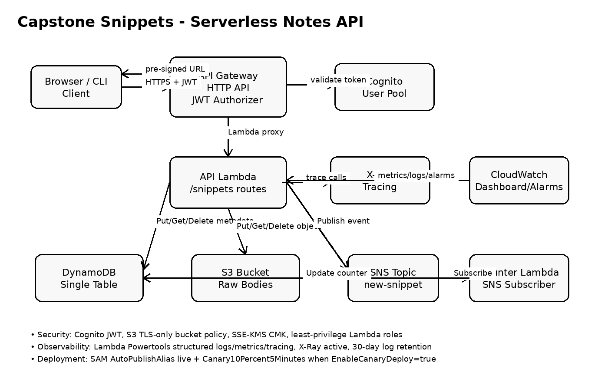

# Capstone Snippets

Capstone Snippets is a small production-style serverless code-snippet service. Users authenticate with Amazon Cognito, call a JWT-protected HTTP API, upload snippet metadata to DynamoDB, store raw snippet bodies in S3, and receive short-lived S3 pre-signed URLs for retrieval. Each new upload publishes a `new-snippet` event to SNS, and a second Lambda subscriber increments a counter in the same DynamoDB single-table design.

The stack is built with AWS SAM and includes X-Ray tracing, structured Lambda logs with AWS Lambda Powertools, 30-day log retention, a CloudWatch dashboard, S3 TLS enforcement, SSE-KMS with a customer-managed KMS key, and SAM canary deployment configuration.

## Architecture



Flow:

1. Client signs up and authenticates through Cognito.
2. Client calls API Gateway HTTP API with `Authorization: Bearer <IdToken>`.
3. API Lambda stores metadata in DynamoDB and bodies in S3.
4. API Lambda publishes `new-snippet` events to SNS.
5. Counter Lambda consumes SNS events and increments a DynamoDB counter.
6. `GET /snippets/{id}` returns a 300-second S3 pre-signed URL.

## Services used

- **Amazon Cognito**: user sign-up, sign-in, and JWT issuing.
- **Amazon API Gateway HTTP API**: public HTTPS API with JWT authorization.
- **AWS Lambda**: route handler for snippets and SNS subscriber for counter updates.
- **Amazon DynamoDB**: single-table metadata and counter storage.
- **Amazon S3**: encrypted raw snippet body storage.
- **AWS KMS**: customer-managed key for S3 server-side encryption.
- **Amazon SNS**: fan-out event topic for `new-snippet` uploads.
- **Amazon CloudWatch**: metrics, alarms, dashboard, and logs.
- **AWS X-Ray**: trace map across API Gateway, Lambda, DynamoDB, S3, and SNS.
- **AWS SAM / CodeDeploy**: infrastructure deployment and canary traffic shifting.

## Deploy in fewer than 10 commands

```bash
export AWS_PROFILE=dva
export AWS_REGION=eu-west-1
export STACK=capstone-snippets

sam build
sam deploy --guided --parameter-overrides EnableCanaryDeploy=false

export API_URL=$(aws cloudformation describe-stacks --stack-name $STACK --query "Stacks[0].Outputs[?OutputKey=='ApiUrl'].OutputValue" --output text)
export USER_POOL_ID=$(aws cloudformation describe-stacks --stack-name $STACK --query "Stacks[0].Outputs[?OutputKey=='UserPoolId'].OutputValue" --output text)
export CLIENT_ID=$(aws cloudformation describe-stacks --stack-name $STACK --query "Stacks[0].Outputs[?OutputKey=='UserPoolClientId'].OutputValue" --output text)

sam deploy --parameter-overrides EnableCanaryDeploy=true
```

The first deploy intentionally disables canary traffic shifting because SAM/CodeDeploy gradual deployments are safest after the first Lambda version and alias exist. The second deploy enables canary configuration for future changes.

## Create a test user and token

```bash
export EMAIL="capstone-test@example.com"
export PASSWORD='TempPass123'

aws cognito-idp sign-up \
  --client-id "$CLIENT_ID" \
  --username "$EMAIL" \
  --password "$PASSWORD" \
  --user-attributes Name=email,Value="$EMAIL"

aws cognito-idp admin-confirm-sign-up \
  --user-pool-id "$USER_POOL_ID" \
  --username "$EMAIL"

export TOKEN=$(aws cognito-idp initiate-auth \
  --auth-flow USER_PASSWORD_AUTH \
  --client-id "$CLIENT_ID" \
  --auth-parameters USERNAME="$EMAIL",PASSWORD="$PASSWORD" \
  --query 'AuthenticationResult.IdToken' \
  --output text)
```

## API smoke test

Create a snippet:

```bash
curl -s -X POST "$API_URL/snippets" \
  -H "Authorization: Bearer $TOKEN" \
  -H "Content-Type: application/json" \
  -d '{"title":"hello","lang":"python","content":"print(\"hello capstone\")"}'
```

List snippets. This uses a DynamoDB `Query` on `GSI1`; it does not use `Scan`.

```bash
curl -s "$API_URL/snippets" -H "Authorization: Bearer $TOKEN"
```

Get a 5-minute pre-signed URL:

```bash
export SNIPPET_ID=<snippet-id-from-post-response>
curl -s "$API_URL/snippets/$SNIPPET_ID" -H "Authorization: Bearer $TOKEN"
```

Delete a snippet:

```bash
curl -i -X DELETE "$API_URL/snippets/$SNIPPET_ID" -H "Authorization: Bearer $TOKEN"
```

## Validate acceptance checklist

```bash
# GET /snippets uses Query, not Scan
grep -R "scan(" -n src || true
grep -R "table.query" -n src

# Lambda IAM policies should not contain Resource: '*' in function policy statements.
# Note: KMS key policies and AWS-managed policies may contain required wildcard resources.
grep -n "Resource: '\*'" template.yaml

# Confirm log retention is 30 days
grep -n "RetentionInDays: 30" template.yaml

# Confirm pre-signed URL expiration is <= 5 minutes
grep -R "ExpiresIn=300" -n src
```

## Clean up in fewer than 5 commands

```bash
export STACK=capstone-snippets
export BUCKET=$(aws cloudformation describe-stacks --stack-name $STACK --query "Stacks[0].Outputs[?OutputKey=='SnippetsBucketName'].OutputValue" --output text)
aws s3 rm "s3://$BUCKET" --recursive
sam delete --stack-name "$STACK" --no-prompts
```

## Notes

- The S3 object resource uses a prefix wildcard such as `snippets/*`; this is normal for least-privilege object access by prefix and is different from `Resource: '*'`.
- The Lambda functions use the AWS-managed `AWSXRayDaemonWriteAccess` policy because X-Ray trace publishing does not support normal application-resource scoping in the same way as S3, DynamoDB, SNS, or KMS.
- For production, add stricter CORS origins instead of `'*'`.
